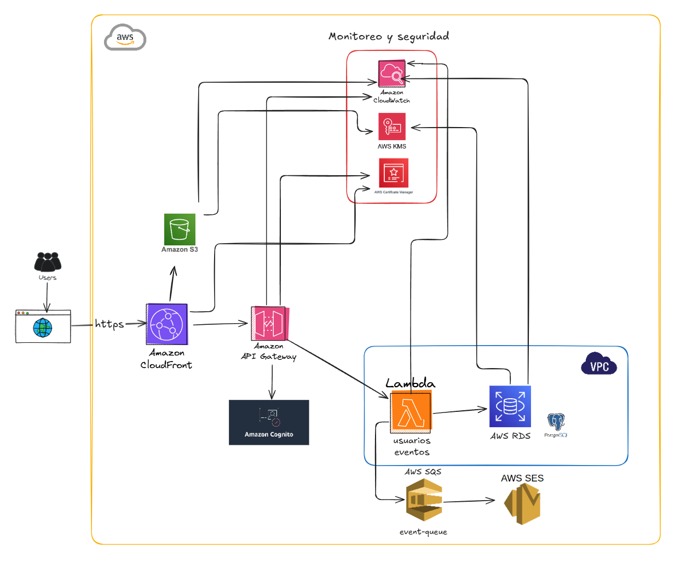

# Proyecto CorpEvent API

## INFRAC

Proyecto de Infraestructura como Código (IaC) para la automatización y gestión de recursos en la nube para la plataforma CorpEvent.

### Autores

* Liu Dai Yan
* De Lama Céspedes Sergio

---
## Diagrama de Arquitectura



---
## Estructura del Proyecto

La estructura del repositorio está organizada de la siguiente manera, separando la infraestructura (Terraform) de la lógica de la aplicación (Python).

```
.
├── application/
│   ├── auth/
│   ├── eventos/
│   ├── notificaciones/
│   ├── registros/
│   └── usuarios/
└── infrastructure/
    ├── apigateway.tf
    ├── iam.tf
    ├── lambda_definitions.tf
    ├── rds.tf
    ├── sns.tf
    ├── sqs.tf
    ├── variables.tf
    └── vpc.tf
```

---
## Requisitos Previos

* Una cuenta de AWS
* [AWS CLI](https://aws.amazon.com/cli/) instalado y configurado (`aws configure`)
* [Terraform](https://www.terraform.io/downloads.html) instalado
* Un cliente de PostgreSQL (ej. `psql`, DBeaver)

---
## Pasos para el Despliegue

1.  **Clonar el repositorio:**
    ```bash
    git clone [URL_DE_TU_REPO]
    ```

2.  **Desplegar la infraestructura:**
    Navega a la carpeta `infrastructure` y ejecuta Terraform. Deberás proporcionar una contraseña para la base de datos.
    ```bash
    cd infrastructure
    terraform init
    terraform apply -var="db_password=TU_CONTRASEÑA_SECRETA"
    ```

3.  **Preparar la Base de Datos:**
    * Obtén el endpoint de la base de datos con `terraform output rds_instance_endpoint`.
    * Conéctate a la base de datos usando `psql` o tu cliente preferido.
    * Ejecuta el script SQL para crear las tablas (puedes crear un archivo `schema.sql` y poner el código `CREATE TABLE` ahí).

4.  **Probar la API:**
    * Obtén la URL de la API con `terraform output api_endpoint_url`.
    * Inserta datos de prueba en las tablas `users` y `events`.
    * Usa `curl` para probar el endpoint de registros:
        ```bash
        curl -X POST \
          -H "Content-Type: application/json" \
          -d '{"userId": 1, "eventId": 1}' \
          [URL_DE_LA_API]/registros
        ```
---